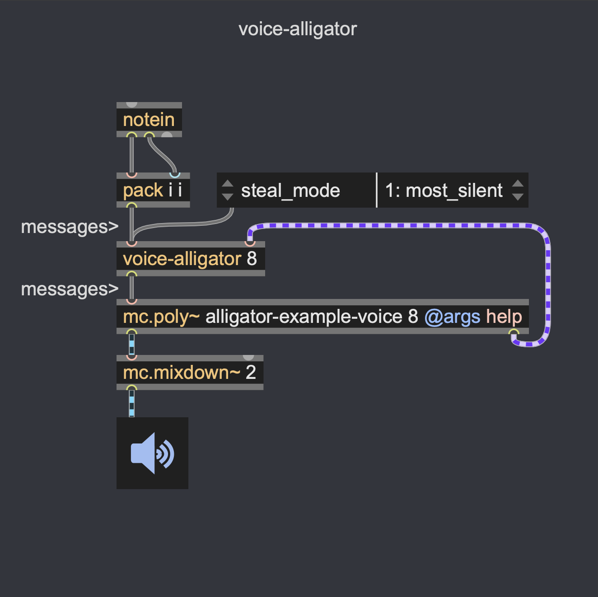
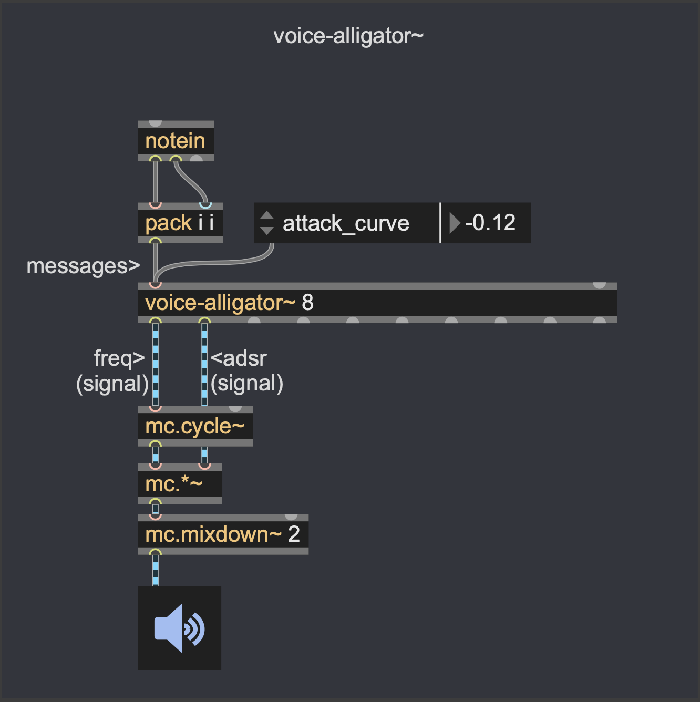
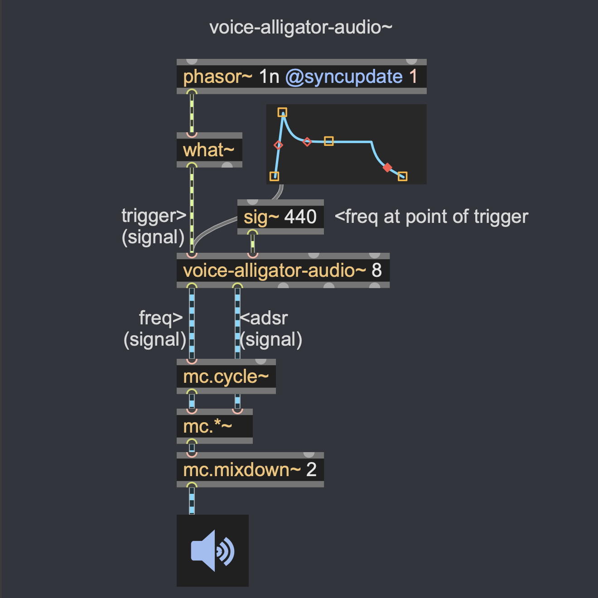

# voice-alligator
suite of voice allocation objects

[voice-alligator] is an external that manages voice allocation. It is designed to work with the [mc.poly~] object and offers several additional features compared to the built-in voice allocation system.

The differences from the built-in voice allocation are best demonstrated through musical examples, which can be found in the "Demo Sequences" in /patchers/voice-alligator-overview.maxpat tab.

[voice-alligator~] is the message-to-signal equivalent of [voice-alligator] with an internal ADSR and legato functionality.

[voice-alligator-audio~] is the signal-to-signal equivalent of [voice-alligator~] with a built-in [makenote] like functionality.

Features:

    - Switch between monophony and polyphony while playing (see demos 1-mono and 2-monoAndHold).
    - Fast and easy scale definition format for alternative scales/microtonal tunings.
    - Differentiate between notes of higher and lower priority on different "streams". (see demo 8-notePriorities)
    - "Hold" notes: notes that stay sustained after key de-press, end/release them at a later time. (see demo 3-portamentoAndHold)
    - Remember pitches during scale changes (see demo 5-scale).
    - Treat notes of different kinds or streams differently, e.g. regarding parameter changes (see demo 4-holdAndPitchwheel)
    - Record pitches and glides instead of MIDI notes for playback after scale changes. (see demo 6-noteLooper and 7-noteLooper2)
    - Configurable steal priorities (oldest, most advanced, most silent)

Written by 
Edis Ludwig (https://edisludwig.com/) and
Jan Godde (https://www.jangodde.com/)